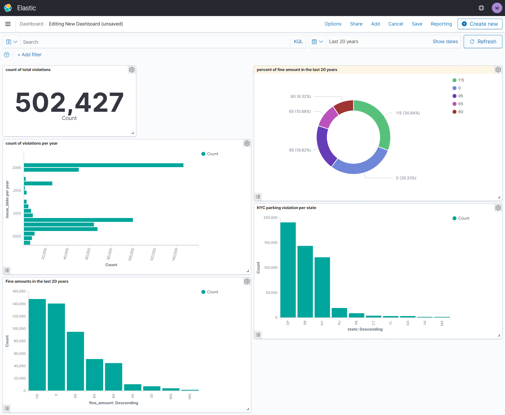

# Parking Violations in NYC Project for STA 9760 Fall 2021

## Project 1 Wei Bin Li

### How to build the docker image
> docker build -t bigdata1:1.0 project01/

### Docker Run Command: 
```docker run \
-v ${PWD}:/app \
-e DATASET_ID="nc67-uf89" \
-e APP_TOKEN="APP TOKEN" \
-e ES_HOST="ES_HOST" \
-e INDEX_NAME="INDEX_NAME" \
-e ES_USERNAME="USERNAME" \
-e ES_PASSWORD='PASSWORD' \
bigdata1:1.0 --num_pages= X --page_size= Y
```
> In command line enter variables  **--page_size**, and **--num_pages** is optional (eg --page_size=1000, --num_pages=3)


## Backgroup
* Build dockerfile to analyze NYC Parking Tickets data from NYC Open Data on Elasticsearch
* Index Name Created on ElasticSearch: parking
* Total Count uploaded: 502,427

### Analyzed Parking Tickets by vizualizing in dashboard: 
> 1) Total Ticket Count (Table)
> 2) Count of Violations per year (horizontal Bar Chart)
> 3) Percent of fee amount in the last 20 years (Pie Chart)
> 4) Fine Amount in the last 20 years (Bar Chart - descending)
> 5) NYC Parking violations per license plate states (Bar Chart - descending)

### Here is the kibana dashboard
